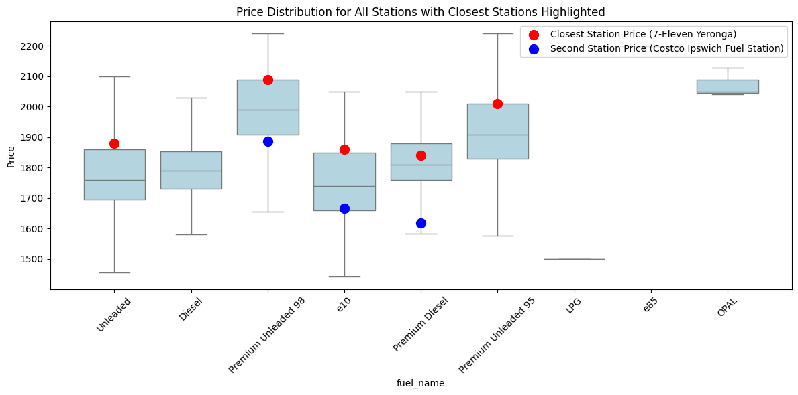

# Fuel Route QLD

**Fuel Route QLD** is a web application designed to help users find the **cheapest route** when traveling by car in Queensland. The app calculates both the **cost** and **time** for each available route, providing users with the best options based on real-time fuel prices and expected travel conditions.

## 🚧 **Note: This project is still under development!** 🚧
### **More features and functionalities will be added in the future.**

## Project Overview

When planning a trip, multiple routes are often available, and costs can vary significantly depending on the route taken. This web app suggests the best routes based on the following factors:
- **Route options** (via Google Maps API).
- **Real-time fuel prices** (from Queensland Government API).
- **Fuel consumption data** for different vehicle types.
- **Average route speeds** (derived from Google Maps).

### Key Features

- **Cheapest Route Finder**: Using real-time fuel prices and route data, the app calculates the trip cost for each route, factoring in both fuel consumption and time.
- **Fuel Price Checker**: Users can find the nearest fuel stations, compare prices, and calculate filling costs, including the cost to drive to the station.
- **Mobile-Friendly**: The web app is designed to be accessible on both desktop and mobile devices for ease of use.

### Screenshots

#### Home Page (index.html)

#### Route Results

## How It Works

1. **Route Calculation**: When a user enters the origin and destination, the app retrieves multiple routes using the **Google Maps API**. 
2. **Fuel Price Integration**: The app retrieves **real-time fuel price data** via the Queensland Government API and finds fuel stations around each route.
3. **Cost Calculation**: 
   - It calculates the **average fuel price** along each route.
   - Using known fuel consumption rates for different vehicle types and the **average speed** from Google Maps, the app calculates the **trip cost**.
4. **Fuel Price Checker**: A separate tool allows users to find the **nearest fuel stations**, view fuel prices, and compare the cost to fill a specific amount (e.g., 50L), factoring in the driving cost to the station.

## Planned Features

1. **Providing Routes via Fuel Stations**: 
   - The app will suggest routes that take into account potential **fuel filling stations** along the way. It will calculate the trip cost considering **price differences at different stations** and suggest where you can save money on fuel.
   
2. **Station Price Comparison**: 
   - The app will include a feature to compare a **specific station's price** level to:
     - The **market average**.
     - **Other stations** within a certain radius.
     - The **regional average**.

## Real-Time Data Testing

To test the real-time fuel-price data, I created a **Jupyter Notebook** that retrieves the data via API and performs basic statistical analysis. This testing phase ensured the accuracy and reliability of the fuel price data integration.
You can see **box plots** of fuel prices to provide insights on a **specific site's price level** compared to the **market average** or **regional average**.

## Fuel Price Checker

The **Fuel Price Checker** is a standalone feature that helps users find the nearest fuel stations and compare fuel prices. This tool calculates:
- **Filling cost**: Based on how much fuel (e.g., 50L) the user wants to purchase.
- **Trip cost**: The cost to drive to each station, deducted from the fuel price to show the most economical option.

## Usage

The web app provides a simple interface where users can:
- Enter their **origin** and **destination** addresses.
- Choose from multiple **route options**.
- View **fuel costs**, **travel times**, and **fuel station information** along the selected route.

The **Fuel Price Checker** allows users to:
- Get real-time data on nearby fuel stations.
- Compare the total fuel cost, including the trip cost to each station.